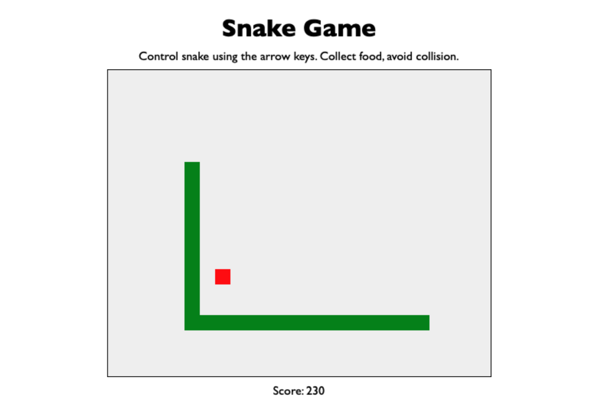

# Snake Game

 

_This is Snake, the game, made with Javascript and HTML canvas._

 

See it in action [here](https://naturalnick.github.io/snake-game/).

 

Screenshot: 

## Summary

Snake is a simple game involving a "snake" and an "apple". The snake is represented by a black line. The apple is represented by a green dot.

Use the arrow keys to navigate the canvas, but if you crash into the walls or yourself, it's game over. When you collect apples, you gain a point and extend the length of the snake by one.

- - 

This was a super fun game to make. I learned a whole lot about objects, HTML canvas, and calculating positioning.

The logic in this was very tricky and I had to step away a few times and just use a pen and paper to figure it out.

## Author

- **Nick Schaefer** - _Full-Stack Software Developer_ - [Website](https://nschaefer.com/) | [LinkedIn](https://www.linkedin.com/in/nick-n-schaefer)
